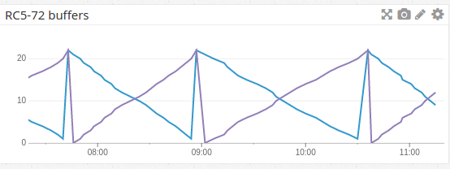

# dogstatsd-distributed.net

Surface metrics from [distributed.net](http://www.distributed.net/Main_Page)
agents and proxies into [datadog](https://www.datadoghq.com/) via
[dogstatsd](http://docs.datadoghq.com/guides/dogstatsd/).

## Requirements

* Perl
* Perl module [File::Slurp](https://metacpan.org/pod/File::Slurp) (Debian package `libfile-slurp-perl`)
* Perl module [Date::Parse](https://metacpan.org/pod/Date::Parse) (Debian package `libtimedate-perl`)
* add files to `/etc/dd-agent/dogstatsd.conf` under `dogstreams:`
* add this script to `cron` (work-in-progress)

## Metrics generated

| metric				| description 						|
| ----					| ----							|
| `dnet.rc5-72.packets_processed`	| number of packets completed since `dnetc` started (RC5-72) |
| `dnet.rc5-72.buffer.buff_out_r72`	| number of packets in completed ("out") buffer (RC5-72) |
| `dnet.rc5-72.buffer.buff_in_r72`	| number of packets in todo ("in") buffer (RC5-72)	|

## Support

Please file tickets via [github](https://github.com/fini-net/dogstatsd-distributed.net/issues).
MR's welcomed whether I [plan to do it](TODO.md) or not.
